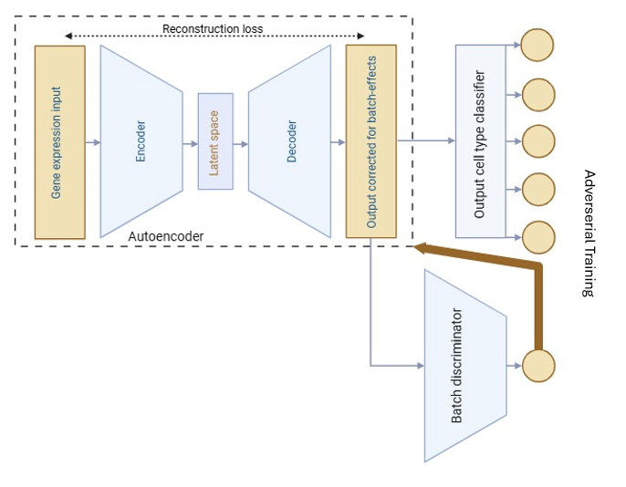

# Neuronal Batch Correction (NBC)

NBC is an autoencoder-based neural network that integrates scRNA-seq or scATAC-seq data from multiple sources, enabling higher-level analysis. The heart of NBC is an autoencoder (a neural network which compresses and decompresses data) trained to fool a batch discriminator, thereby removing batch effects, while an output cell type classifier simultaneously trains the autoencoder to preserve biological information.

<p align="center">
  
</p>

## Features

- **Batch Effect Removal**: Effectively eliminates technical variation between datasets
- **Biological Signal Preservation**: Maintains cell type identity and biological signals
- **Support for Multiple Modalities**: Works with scRNA-seq and scATAC-seq data
- **Simple API**: Easy integration with existing single-cell analysis pipelines
- **Scalable**: Handles datasets of varying sizes efficiently

## Installation

NBC can be installed directly from GitHub:

```bash
pip install "git+https://github.com/lorenzkleiter/Neuronal-Batch-Correction.git"
```

## Dependencies

- Python = 3.10
- Tensorflow = 2.19.0
- Scanpy = 1.11.1
- Scib = 1.7.1

## Usage Example

```python
import nbc 

# Integrate data across batches
integrated = nbc.integration(adata, batch_key, label_key, epochs, batch_size)
```

### Parameters

- `adata`: AnnData object with a sparse matrix under `adata.X` and columns for batch and cell type annotations under `adata.obs`
- `batch_key`: Name of batch annotation column
- `label_key`: Name of cell type annotation column
- `epochs`: Number of training epochs. More epochs give better results but increase training time (recommended: >5, ≤100)
- `batch_size`: Training batch size. Smaller batch sizes tend to give better results but increase training time (recommended: ≥32, ≤1024)

### Return Value

- `integrated`: AnnData object with an integrated sparse matrix under `adata.X`. The `obs` attributes are preserved from the input. There is currently no option for in-place integration.

## Performance Tips

- For very large datasets (>100k cells), consider increasing batch size to speed up computation
- For highly heterogeneous datasets, increasing the number of epochs may improve integration quality

## Citation

If you use NBC in your research, please cite:
```
Citation information will go here
```

## License
This software is completely free to use for any purpose - academic, commercial, or personal - with no restrictions. You may modify, distribute, or incorporate it into other software without attribution.
